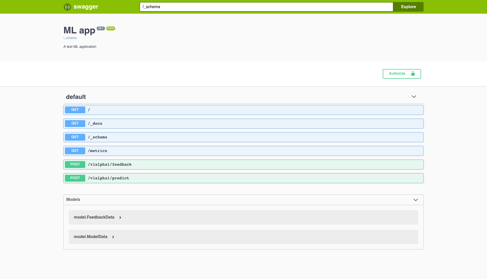
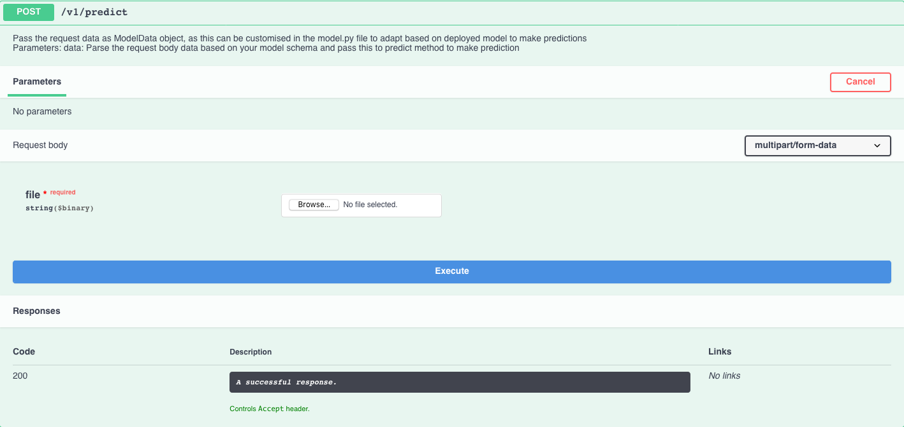

# MLapp

A web application to serve model based on Fastai v1 library. Application is based on [Molten Framework](https://moltenframework.com/) due to it's inbuild support for modern tooling: [Swagger](https://swagger.io/), [OpenAPI](https://www.openapis.org/), [Prometheus](https://prometheus.io/) etc.

## Motivation

I wanted to have an application which allow me to serve ML models in real production settings. Application should provide:

* Versioned APIs
* Metrics (prometheus)
* Ablility to run different version of models without unnecassary code changes
* User friendly API documentations
* Input data validation
* Authentication
* Inference device flexibility (CPU or GPU)
* Scale up or down instances based on incoming traffic

So that I can focus on my ML model improvment and don't need to bother about how to serve the model in produciton.

## Design

Application design is simple. `app.py` set up the routes and required methods to get data in and out. Following routes are exposed by application.

```
/               -> Returns health information and serve as liveness check for application
/_docs          -> Serves Swagger UI to provide API docs and user friendly API testing
/_schema        -> json formatted API spec in OpenAPI standard
/metrics        -> Endpoint to scrape metrics by Prometheus
/v1/predict     -> Receives end user data to make prediction on
/v1/feedback    -> User can provide feedback on prediction if there was any errors
```

API is **versioned** which makes evolution of our application possible without introducing any breaking changes to downstream applications. `app.py` **validates data** according to schema descibed in `model.py` file using Molten framework. The current application provides a simple CNN model which was described in Lesson 1 of [Fast v1](https://github.com/fastai/fastai/) course using schema shown below for `predict` endpoint. For more details see `model.py` or [Molten docs](http://moltenframework.com/)

```python
@schema
class ModelData():
    file: UploadedFile
```

Idea is that based on a given model, you can update the schema in this class and let Molten take care of validation for you and provide a user friendly docs and test interface as shown.



To test API either using `curl` or swagger UI can be used

```bash
curl -X POST "http://localhost:8000/v1/predict" -F "file=@keeshond.jpg"
```



## Configuration

Application uses `config.json` to provide various options.

```raw
{
    "model_name": "v1",     -> Specify the model from multiple models in your config as which one you want to run with this instance
    "token": "",            -> To enable authenticaiton to you APIs
    "v1": {                 -> Model name and its corresponding config. These can be different based on your model
        "device": "cpu",    -> Device on which to run inference (cpu, cuda)
        "url": "",          -> URL to fetch the weights file .pth from. If empty app assumes local file under models dir
        "arch": "resnet34", -> Model Architecutre
        "size": 224,        -> Image size
        "classes": []       -> Classes used during training from which prediciton will happen
    }
}
```

## Metrics

Prometheus + Grafana

## Deployment

Kubernetes
traffic shifting etc

## Load testing

## TODO

* Add support for ONNX